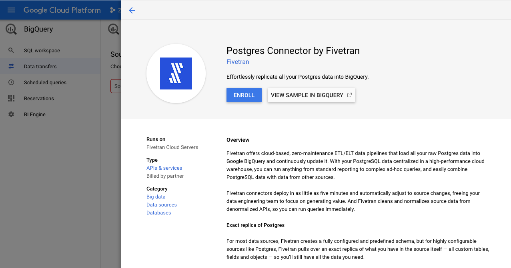
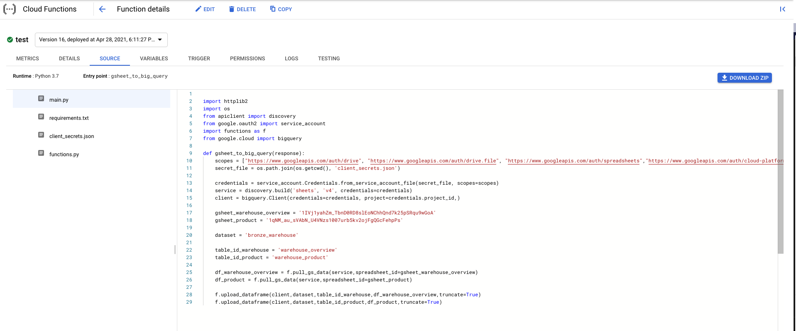
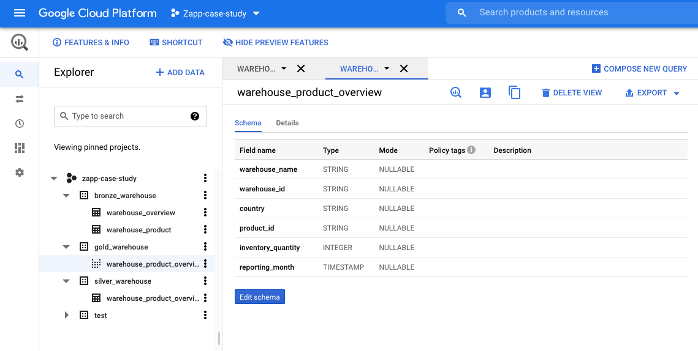
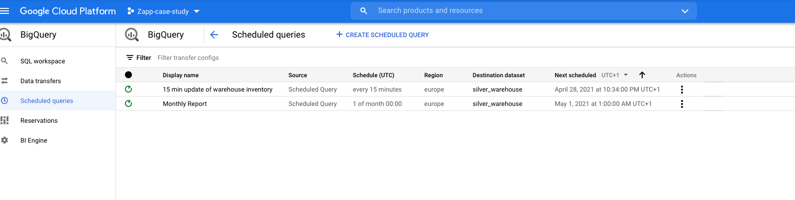
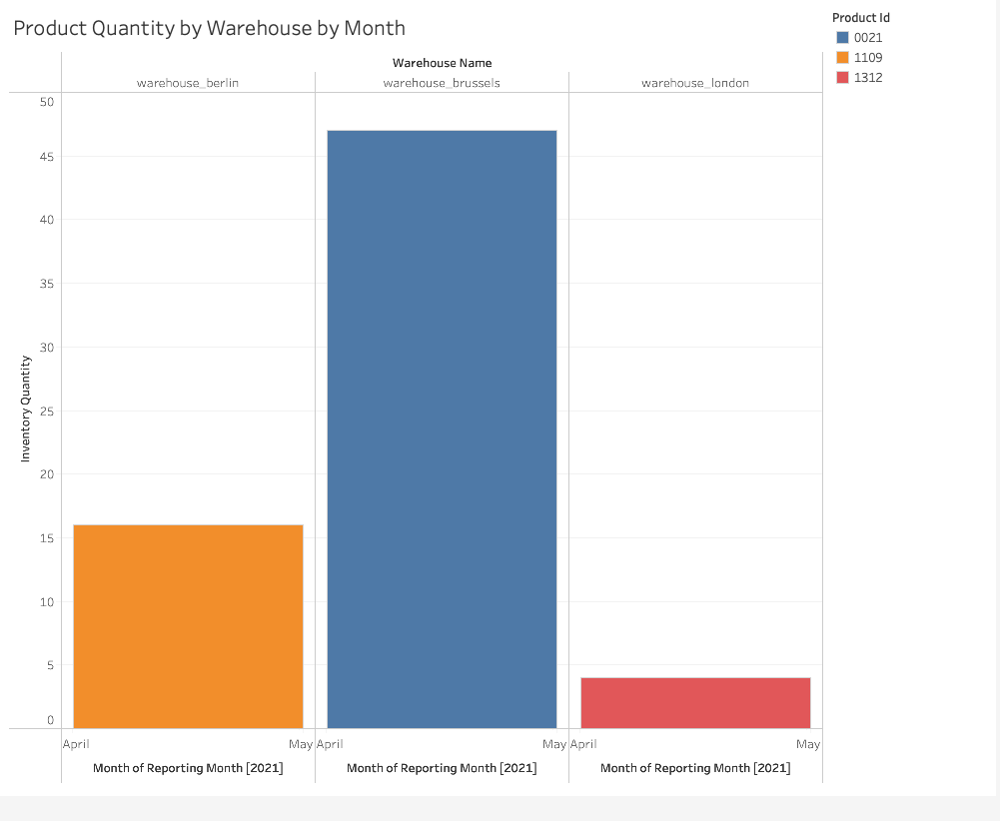
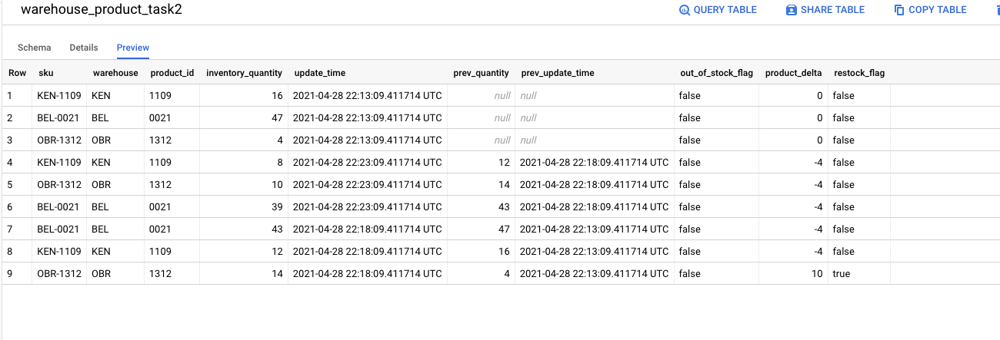
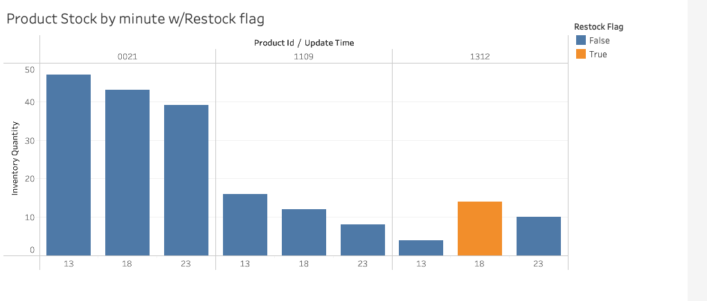

# Zapp Case Study

## Setup

To learn a bit more about GCP I decided to build data pipelines using some GCP tools and the python library. I used google sheets as the original data source instead of a Postgres DB. The data for the google sheets can be found in the dummy_data folder.

To set this up I needed to create a service account. I stored the credentials in a file called client_secrets.json (same structure as client_secrets_example.json). I enabled a few of the GCP apis and gave my service account access to the google sheets files.

For the BigQuery schema architecture, I've gone with the Bronze, Silver, Gold schema approach where Bronze is raw data, Silver is cleaned data and Gold is ready to be reported on.

I'm also making the most of the 14 day free trial that Tableau provides to test the BigQuery -> Tableau connection

Below I've described each step I would take to complete the task along with referencing the python scripts I used to build my test pipeline, which also contains my sql code.

All my functions can be found in the `functions.py` file

## Task 1
question:
How would you create a report for stock levels for each warehouse in each country at end of month?

Steps:
1. Upload data into BigQuery from the Postgres DB into a "Bronze" Schema
    - First job is to create the dataset and tables in BigQuery (see python example `create_dataset_tables.py`). This will create a "bronze_warehouse" schema with 2 tables (`warehouse_overview` and `warehouse_product`)

    - Then we create a link to the Postgres DB using the BigQuery Data Transfer Service, possibly using an ETL tool such as FiveTran, which would create exact replica of the Postgres DB.
    

    - I have played around with a couple of other methods to get data in BigQuery from gsheets using the BigQuery python library. One is utilising gcloud functions (copying whats in the `gcloud_function_example` folder into GCP) and the other runs locally (see `gsheet_to_big_query.py`).
    

2. Upload cleaned data into a "Silver" Schema
    - To get the table needed for the report we need to merge the 2 tables. The product table contains the warehouse information inside the sku so that'll need to be extracted in order to merge onto the warehouse overview
    - The output is one table (`warehouse_product_overview`) with all the information needed for the report which is to be stored in a "Silver" Schema
    
    - I've created a scheduled query (see `bronze_to_silver.py`) to run once a month
    
    

3. Create Report
    - Tables for reporting should live in a separate "Gold" Schema. In this case the report table matches the table in the "Silver" schema so creating a view of that table will be sufficient (see `silver_to_gold.py`)
    - Tableau will have access to this schema and can be refreshed each month to generate the latest numbers
    

## Task 2
question:
How would I calculate restock times?

1. Upload data into BigQuery from the Postgres DB into a "Bronze" Schema
    - Follow the same process as step 1 in the above task to pull data into BigQuery every 5 minutes. The raw data will go into the `zapp-case-study.bronze_warehouse.warehouse_product_task2` table created by `create_dataset_tables_task2.py`. The data will be appended to the table and the update time will also be captured.
    - The `gsheet_to_bigquery_task2.py` will upload the data from the product google sheet (same as product.csv in dummy_data) into the `warehouse_product_task2` table. I have set it up so that it will run 3 times, to resemble new data coming in every 5 minutes
2. Upload the data into a new table in a the "Silver" schema
    - I've created a scheduled query to run every 15 minutes (see `bronze_to_silver_task2.py`)
    

    - This new table will show the stock quantity at each timestamp, as well as the previous stock quantities and deltas, using window functions. This will allow us to create a flag for items that have just been restocked (if there is a positive delta) or items that are out of stock
    
3. Create Report
    - Tables for reporting should live in a separate "Gold" Schema. In this case the report table matches the table in the "Silver" schema so creating a view of that table will be sufficient (see `silver_to_gold_task2.py`)
    - Tableau will have access to this schema and can be refreshed each month to generate the latest numbers
    
